<!-- $theme: gaia -->
<!-- template: invert -->

# DevOps 是什么不是什么

##### -- 给研发人员的另类管理入门课
##### Bin Liu
##### 2017.4.23  node-party #21
##### http://github.com/liubin/node-party-21

---

# 自我介绍

### 

###### 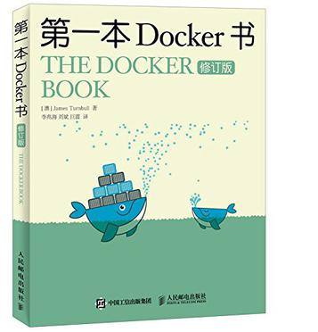 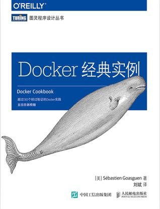 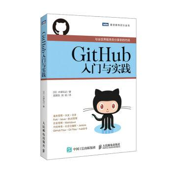
---

# Agenda

1. 什么是 DevOps ，DevOps 发展史
2. DevOps 中的管理哲学
3. DevOps 之道
4. 支撑 DevOps 的工具链

---

# 1. 什么是 DevOps

---

# What's DevOps

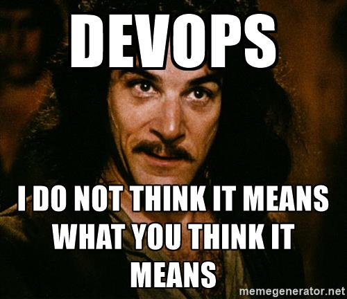

---
<!-- page_number: true -->

# DevOps 是什么？

- 一个职位？
- 一个部门？
- 一套工具？
- 基础设施自动化？
- 敏捷？
- 你理解的 DevOps ？

---

<!-- page_number: false -->

# 无数人眼中有无数个定义

---
<!-- page_number: true -->


> DevOps is about ==**minimizing the challenges of shipping, rapidly iterating**==, and securing software applications.
>
> <small>-- *HashiCorp*</small>


---


> DevOps is an enterprise capability for ==**continuous (software) service delivery**== that enables clients to ==**seize market opportunities**== and ==**reduce time to customer feedback**==.
>
> <small>-- *IBM*</small>


---

> DevOps is a ==**methodology**== that ==**combines what used to be the separate and sequential processes of development and operations into a continuous process**== of understanding a ==**market need**==, refining an application or service to meet that need, and testing and deploying the solution.
>
> <small>-- *CA*</small>

---

> DevOps is an approach to bridge the gap between agile software development and operations. 
>
> <small>-- *agileweboperations.com*</small>

---

> DevOps is a term used to refer to a ==**set of practices**== that emphasize the ==**collaboration and communication**== of both software developers and information technology (IT) professionals while ==**automating the process of software delivery and infrastructure changes**==. It aims at establishing a ==**culture and environment**== where ==**building, testing, and releasing software can happen rapidly, frequently, and more reliably**==.
>
> <small>-- *Wikipedia*</small>

---

> Devops is not a methodology or framework, but is a set of principles to ==**break down silos**==

---

> DevOps 是 ==**IT 价值流中应用精益理论**== 的结果
>
> <small>--*《凤凰项目》*</small>

---

# DevOps 是？

- rapidly、frequently、reliably
- continuous service delivery
- methodology、practices
- business（customer、market）
- break down silos(collaboration、communication)
- automating
- culture

---


- 第一代运维？
- 自动化
- 云计算

---

# Ops ?

- system engineers
- system administrators
- operations staff
- release engineers
- DBAs
- network engineers
- security professionals
- IT

---

# DevOps 产生背景

- 快速变化的市场、需求和竞争
  - 快速
  - 频繁
- 应用程序架构的演进
  - IaaS/PaaS
  - 单体到微服务
  - Lambda
  - Cloud Native Application
- 敏捷开发
- 云计算

---

# 矛盾5要素

- 速度
- 质量
- 成本
- 安全
- 体验

---
<!-- page_number: false -->

# Dev vs Ops vs Else

##### 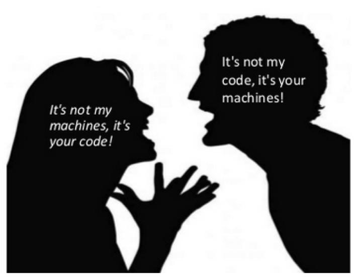

##### 同一个梦想，不一样的手段

---
<!-- page_number: true -->

# 鸿沟

- 理论/方法学
- Mission
- 考核指标
- 工具
- 流程
- 自动 vs 手动
- 合作 vs 甩锅
- Function-driven vs Interrupt-driven

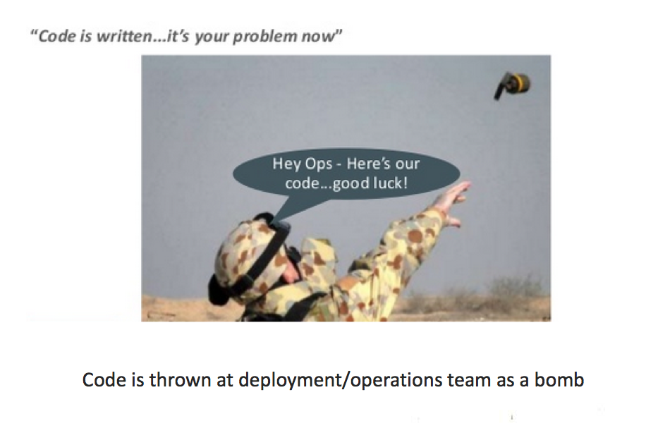

---

<!-- page_number: false -->

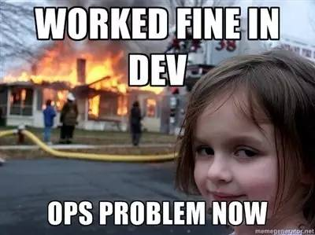

---

<!-- page_number: true -->

# DevOps 的出现

- [Agile Infrastructure & Operations](http://www.jedi.be/presentations/agile-infrastructure-agile-2008.pdf) , agile 2008, Patrick Debois
- [10+ Deploys per Day: Dev and Ops Cooperation at Flickr](https://www.slideshare.net/jallspaw/10-deploys-per-day-dev-and-ops-cooperation-at-flickr) , Velocity 2009, Flickr
- DevOpsDays, 2009
- #devops

---

# 工具

- 自动化基础设施
- 共享版本控制
- 一步构建和部署
- feature flags
- 共享的 Metrics
- IRC 和 IM 机器人

---

# 文化

- 尊重
- 信任
- 正视失败
- 避免责备

---

<!-- page_number: true -->

# 推进 DevOps 的目的

- Dev 和 Ops 的合作 47%
- 并行跨平台部署 41%
- 进入新市场或者满足客户需求的TTM 41%
- 提高用户体验 39%
- 在云中开发、部署应用 31%
- 混合云的复杂化 28%
- 降低IT成本 16%

<small>*- What Smart Businesses Know About DevOps*</small>

---

# DevOps 收益（实际效果）

- 提高部署频率 53%
- 加强部门间的协作 48%
- 降低开发和运维的成本 46%
- 提高部署的应用的质量 42%
- 提高用户数 35%
- 降低TTM 35%
- 降低投入人员数量 38%
- 实现跨平台 45%
- 增加收入 28%

---

# DevOps 所需技能

- 对商业优先级、战略和度量的知识 47%
- 了解当前商业流程 42%
- 沟通技巧 36%
- 流程重构技巧 33%
- 项目管理技巧 30%
- 个人技能 30%
- 编程能力 24%
- 质量保证和测试技能 19%

---
<!-- page_number: false -->

# 2. DevOps 中的管理哲学

---

#### 从敏捷开发说起

---

# SDLC 

### Software Development Life Cycle

### 

---

<!-- page_number: true -->

# Agile 价值观

- ==个体和互动== 高于 流程和工具
- 工作的软件 高于 详尽的文档
- 客户合作 高于 合同谈判
- ==响应变化== 高于 遵循计划

---

# Agile 原则

- ==持续不断== 地及早交付有价值的软件。
- ==欣然面对需求变化== ，敏捷过程掌控变化。
- 以 ==较短的周期== 交付可工作的软件，相隔几星期或一两个月。
- == 业务人员和开发人员必须相互合作== 。
- 激发个体的斗志，以他们为核心搭建项目。
- 传递信息效果最好效率也最高的方式是 ==面对面的交谈== 。

---

# Agile 原则

- 可工作的软件是进度的首要度量标准。
- 敏捷过程倡导 ==可持续== 开发。
- 坚持不懈地追求技术卓越和良好设计，敏捷能力由此增强。
- 以 ==简洁为本== ，它是极力减少不必要工作量的艺术。
- 最好的架构、需求和设计出自 ==自组织团队== 。
- 团队 ==定期地反思== 如何能提高成效，并依此调整自身的举止表现。

---

# Extreme Programming

### 核心价值观
- ==沟通== （Communication）
- ==简单== （Simplicity）
- ==反馈== （Feedback）
- 勇气（Courage）
- 谦逊（Modesty）

---

# XP的 13 个核心实践

- 完整团队（Whole Team）
- 计划游戏（The Planning Game）
- 结对编程（Pair programming）
- ==测试驱动开发== （Testing-Driven Development）
- 重构（Refactoring）
- 简单设计（Simple Design）
- 代码集体所有权（Collective Code Ownership）

---

# XP的 13 个核心实践

- ==持续集成== （Continuous Integration）
- 客户测试(Customer Tests）
- ==小型发布== （Small Release）
- 每周40小时工作制（40-hour Week）
- 编码规范（Code Standards）
- 系统隐喻（System Metaphor）

---

<!-- page_number: false -->

# 我们的定义

## DevOps = ==Agile(SDLC)==

---
<!-- page_number: true -->

# 阿姆达尔法则

- Designing a high performance organization is similar to designing a high performance application
- The theoretical throughput of a system is limited by serial latency
- Output is limited by serial coordination
- Empowering individuals to work independently improves throughput

---

# 康威定律

> A system’s design is a copy of the organization’s communication structure.
> 
> -- <small>Melvin Conway, 1967</small>

---

# PDCA

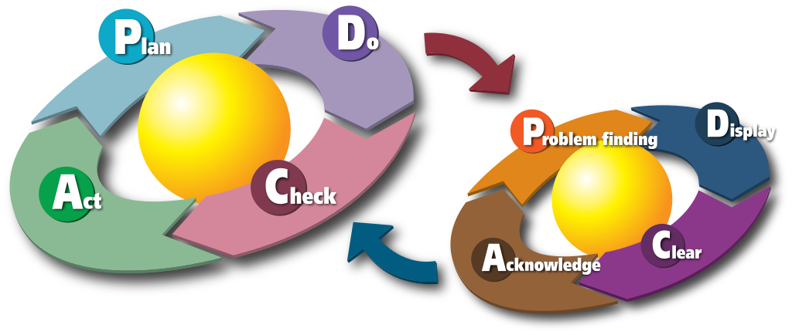

- Plan（5W1H：What/Who/Why/When/Where/How）
- Do
- Check
- Act（改善）
- ==P-P-P-P== or ==D-D-D-D==

---

# OODA

- Observe
- Orient
- Decide
- Act
- F-86 vs MiG-15（视野、响应时间）
- ==OO-OO-OO==

---

<!-- page_number: false -->

# 精益（ LEAN ）

##### Goal: 持续可能的最短 Lead Time
##### TPS(Toyota Production System)
##### Philosophy of continuous improvement
##### 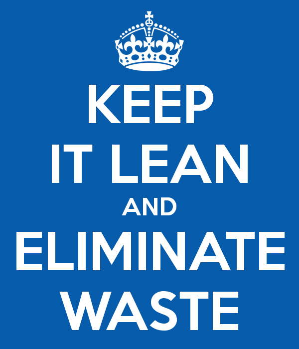

---

<!-- page_number: true -->

# Lean 7 条原则

- ==消除浪费==
- 质量內建
- 创造知识
- 推迟决定
- 迅速提供
- 尊重个人
- ==全体优化==

---

|生产|软件|浪费示例|
|:--|:-:|--:|
|库存| 未完成工作 | <small><small>未 review 的设计、未测试的代码</small></small>|
|加工| 和进度、质量无关| <small><small>申请、签字</small></small>|
|动作| |<small><small>不产生附加价值、不合理、效率不高：手工</small></small>|
|过度制造| | <small><small>用户不需要的功能、不会执行的代码</small></small> |
|搬运| 交付无关 | <small><small>任务切换、本职工作以外；人员变动</small></small> |
|待工| 等待依赖 | <small><small>硬件到位、UI设计完成、人员到位</small></small> |
|不合格品| Bug | <small><small>Bug</small></small> |

---

# Value Stream Mapping

- 创造价值相关的 ==“材料”和“信息”== 的可视化和共享。
- Process && Lead Time
- 关键路径 in SW

---

<!-- page_number: false -->

# 3. DevOps 之道

---

<!-- page_number: true -->


# 我们的定义

## ==工具辅助流程==
## ==跨职能部门==
###### Dev/Ops/QA/Sec/Product/Market/HR/Fin

---

# DevOps 要素

- IT自动化 52%
- 敏捷开发 47%
- 开发和运维之个人之间的团队合作 45%
- 服务虚拟化 42%
- 加速的应用程序测试 32%
- 持续发布 32%
- 一致的开发运维流程 25%
 
<small><small><small>*from: TechInsights Report: What Smart Businesses Know About DevOps*</small></small></small>

---
<!-- page_number: false -->

# Operation as a Feature

---
<!-- page_number: true -->

# The Three Ways

- Gene Kim - 《凤凰项目》作者
- System Thinking （系统思考、强调全局优化，缩短 Lead Time ）
- Amplify Feedback Loops （放大、及时的反馈回路）
- Culture of Continual Experimentation And Learning（持续实验、学习和改善）。

---

# CALMS

- Jez Humble -《持续交付》作者
- Culture - People / Process
- Automation
- Lean
- Metrics
- Sharing - Collaboration/Feedback

---

> ==**values and behaviours**== that contribute to the unique social and psychological environment of an organisation.
> 
> Culture is basically a ==**reflection of how and why people go about their jobs**==

---

# Infrastructure as `Code`

- 减少手工
- 版本化
- 持续集成
- 自动化（测试、部署）
- 可重现
- 可审计

---

# Metrics-driven development

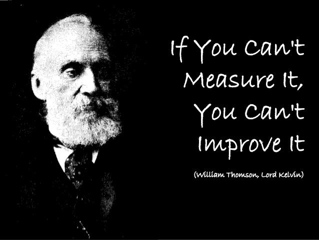

> The use of real-time metrics to drive rapid, precise, and granular software iterations.

---

# Metrics-driven development

- “Moving Fast at Scale” - Etsy
- 发现性能瓶颈
- 定位问题
- 提高稳定性
- 降低成本
- Metrics as a Feature

---


# Continuous Integration


> Continuous Integration is a software development practice where members of a team ==integrate their work frequently==, usually each person integrates at least daily - leading to multiple integrations per day. Each integration is ==verified by an automated build== (including test) to detect integration errors ==as quickly as possible==
> 
>  – Martin Fowler

---

# Continuous Delivery

> Continuous delivery is a software engineering approach in which teams ==produce software in short cycles==, ensuring that the software can be ==reliably released at any time==. It aims at building, testing, and releasing software ==faster and more frequently==. The approach helps reduce the cost, time, and risk of delivering changes by allowing for more incremental updates to applications in production.
> 
> <small>from Wikipedia “Continuous delivery”</small>

---

# Continuous Delivery

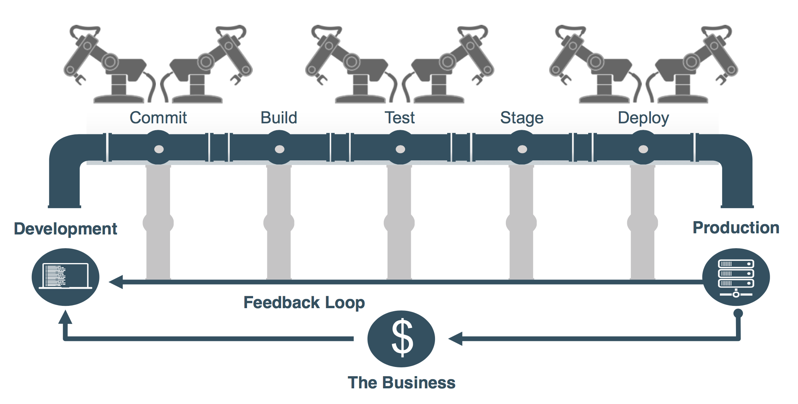

<small>*Why, What, and How of Continuous Delivery*</small>

---

# Continuous Delivery

- Also Provisioning & Configuration
- TDD
- Code Review
- CI
- 打包、部署
- 集成测试（功能、性能）自动化
    
---

## Continuous Deployment

---

# Continuous Everything

- Continuous Integration
- Continuous Delivery
- Continuous Deployment
- Continuous Learning
- # ==Continuous Kaizen==
- ==Continuous== Everything

---

# Pipeline

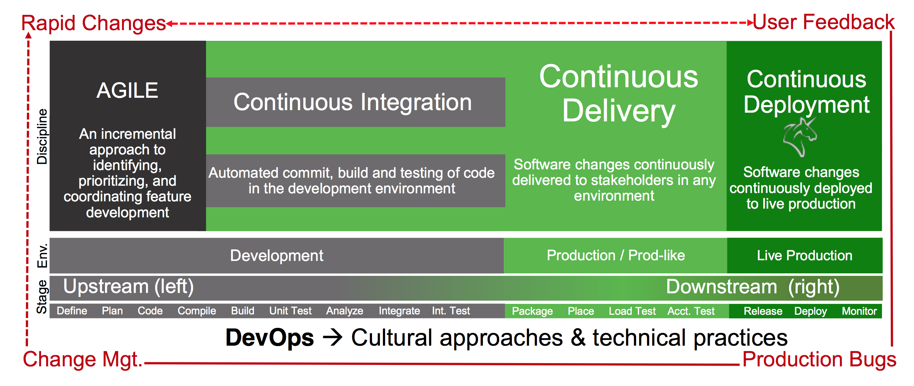

<small>*Why, What, and How of Continuous Delivery*</small>

---
<!-- page_number: false -->

# 一个演示

---

# 但是
---
# Meetup 三大魔咒
---
# 1. 拖堂
---
# 2. 话筒
---
# 3. 演示

---

# 我们的方案是？
---
# 录像
---

<!-- page_number: true -->

# SRE

> Fundamentally, it's what happens when you ask a software engineer to design an operations function

- IT 运营
- 提高系统的可用性

---

<!-- page_number: false -->

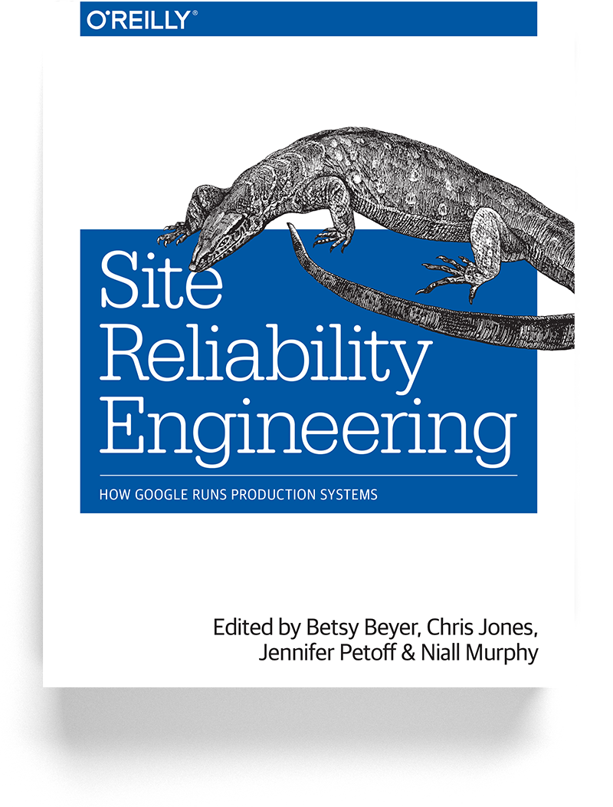
###### [Site Reliability Engineering: How Google Runs Production Systems](https://landing.google.com/sre/)，中文版 《SRE: Google运维解密》

---

<!-- page_number: true -->

# DevOps 对应用架构的影响

- Container、Microservice、Function
- Cloud Native Application
- Feature flags
- Blue/green deployment 
- Canary release
- Immutable infrastructure
- Golden Image

---

# 实施 DevOps 的障碍

- 组织结构太复杂，太多人、部门和依赖 35%
- Dev 和 Ops 之间的角色、责任不一致 38%
- 安全或监察顾虑 35%
- 对整个开发生命周期认识不足 24%

<small><small>*from: TechInsights Report: What Smart Businesses Know About DevOps*</small></small>

---

<!-- page_number: false -->

# DevOps 象限

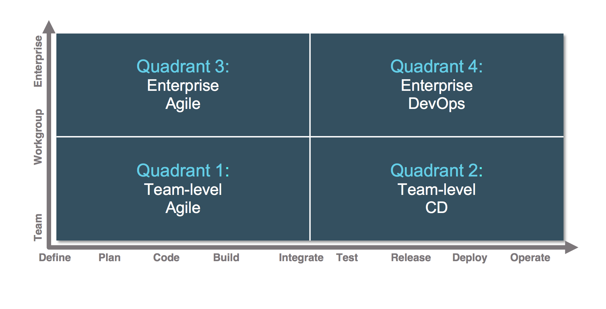

<small>*Why, What, and How of Continuous Delivery*</small>

---
<!-- page_number: true -->

# 成熟度模型

- Change agent(s)
- Grass roots
- Top down
- Scale

---
<!-- page_number: false -->

# 4. 支撑 DevOps 的工具链
---

<!-- page_number: true -->

# 沟通工具

- Mail
- IM
- JIRA/Trello/Bugzilla
- Slack/Bearychat
- IFTTT

---

# Provisioning toolchain

- Bootstrapping
  - AWS/Azure/Vmware/Vagrant/OpenStack
  - Docker
- Configuration
  - Puppet/Chef/Ansible
  - AWS OpsWorks
- Orchestration
  - Mesos/K8s/Swarm
  - Nomad

---

# Container

- Docker/rkt
- Orchestration

---

# Docker

- Build, ship, run
- Docker Image
- Network/Storage
- Docker Hub
- Docker Cloud

---

# Orchestration

- Mesos
- K8s
- Swarm

---

# ChatOps

- 沟通工具
- Hubot
- 自动化工具
- 连接人、工具、服务
- HipChat/Slack/Bearychat

---

# AWS

- CloudFormation
- OpsWorks
- CodePipeline
- CodeCommit、CodeBuild、CodeDeploy
- Lambda
- Elastic Container Service
- X-Ray
- Elastic Beanstalk

---

# Atlassian

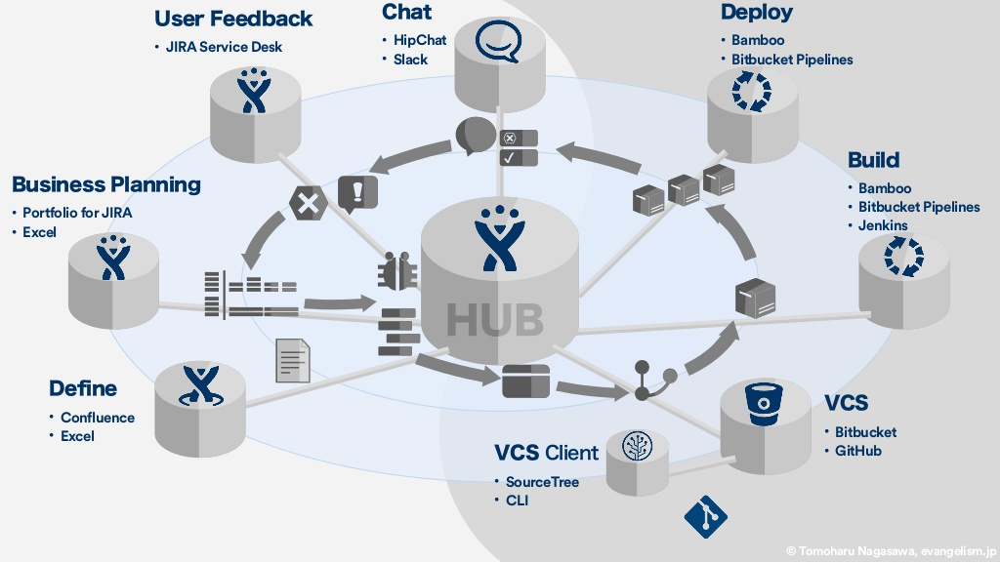

---
<!-- page_number: false -->

# 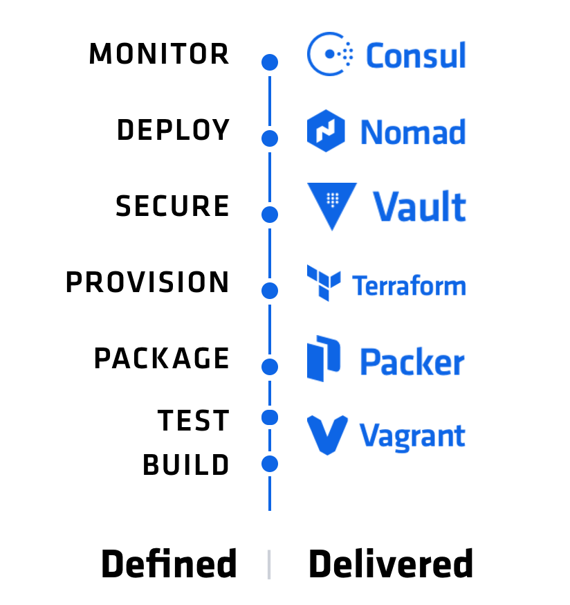

###### Hashicorp

---
<!-- page_number: true -->

# Terraform

```
resource "github_repository" "example-repo" {
  name        = "example-repo"
  description = "New repository for use with Terraform"
}
```

---

<!-- page_number: false -->

# 

---

# 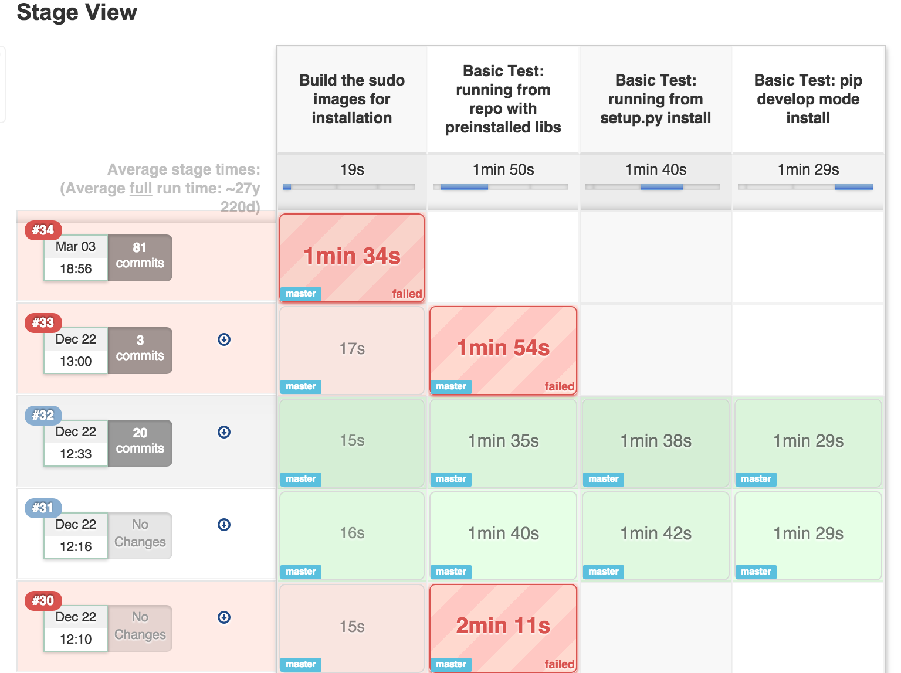

---

# Conclusions

- 不是一个部门或者一个职位
- 也不是自动化或者 Docker、Ansible
- 是一套方法论、最佳实践、组织管理学
- Not a switch, DevOps is a journey
- DevOpsSec？安全和审计

---

### 

---

# Don't just do DevOps, be DevOps.


---

# Thank you for listening

#### We are hiring
# alauda.cn
#### 

---

<!-- page_number: true -->

# DevOps geeks

##### 

##### Gene Kim
##### Website: www.realgenekim.me

##### The Phoenix Project、The DevOps Handbook

---

# DevOps geeks


##### 
##### Jez Humble

##### Website: https://continuousdelivery.com


##### Continuous Delivery、 The DevOps Handbook

---

# DevOps geeks

##### 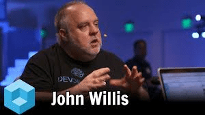
##### John Willis
##### Website: https://blog.docker.com/author/john-willis/

##### The DevOps Handbook、CALM

---

# DevOps geeks

##### 
##### Patrick Debois
##### Website: http://www.jedi.be/
##### DevOpsDays、The DevOps Handbook

---

# DevOps geeks

##### 
##### James Turnbull

##### Website: https://jamesturnbull.net

##### Puppet Labs、Docker Inc
##### Terraform/Consul/Docker/Monitoring/Puppet/Nagios/Logstash/Linux

